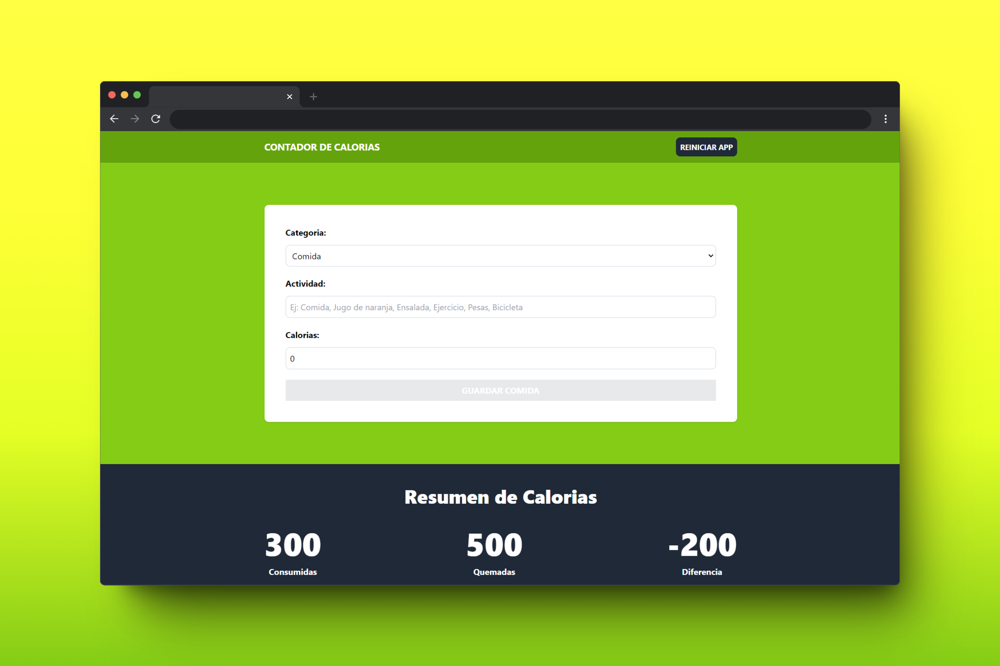

# 📊 Calorie Tracker

## 📖 Project Description
Calorie Tracker is a web application where you can keep track of your consumed calories along with the calories burned through physical activity. Additionally, you can view the difference, helping you determine if you are in a caloric deficit or surplus.

## 💻 Technologies Used
 

## 📚 What I Learned
This is my first project using forms in React. In this project, I learned to read user data through a form, process it, and perform various operations such as validation and more. Additionally, I learned about `useReducer` to manage complex states in my apps.

## 📫 Contact Information

 
 
 
 
